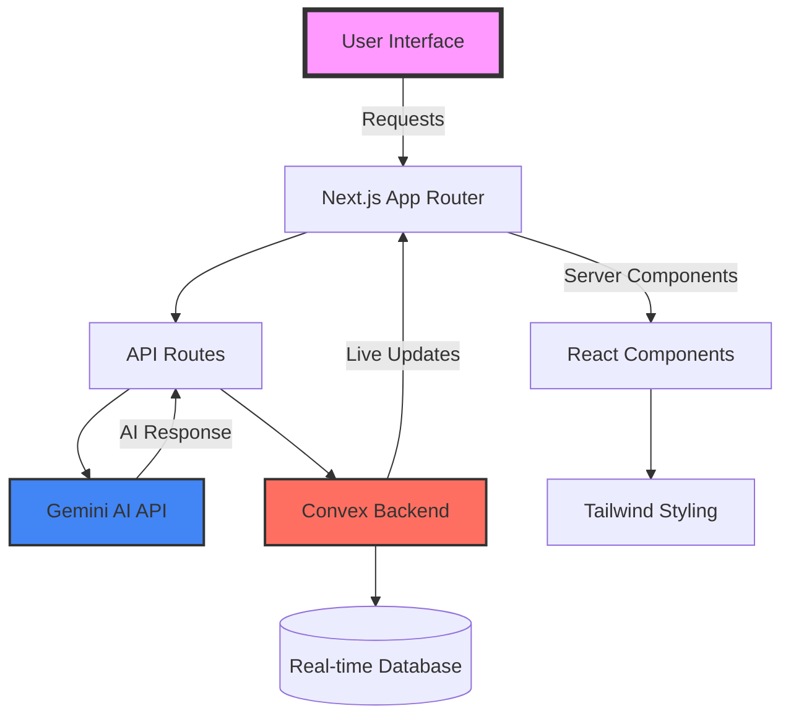
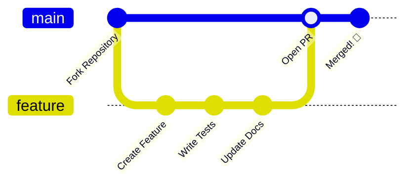

<p align="center">
  
</p>

<h1 align="center">🚀 AI-Powered Website Builder</h1>

<p align="center"><i>Build Stunning Websites with AI Assistance</i></p>
<p  align="center">Transform your ideas into fully functional websites using cutting-edge AI technology.
</p>

<p align="center">
  <a href="https://opensource.org/licenses/MIT">
    
  </a>
  
  
  
  
</p>


<p align="center">
  
  
  
  
</p>


<!-- Animated Line Break -->


<!-- About Section with Cool Icons -->
<h2 align="center">
  
  About The Project
  
</h2>

<div align="center">
  <table>
    <tr>
      <td align="center" width="50%">
        
        <br/>
        <sub><b>Real-time Code Generation</b></sub>
      </td>
      <td align="center" width="50%">
        
        <br/>
        <sub><b>In-built Live Preview</b></sub>
      </td>
    </tr>
  </table>
</div>

<div align="center">
  <br/>
  
  > 🌟 **AI Website Builder** is a cutting-edge platform that revolutionizes web development by combining the power of **Gemini Flash 2.0 AI** with modern web technologies. Transform your ideas into fully functional, beautiful websites using natural language - no coding experience required!
  
</div>
<div  align="center">
     ⚠️ Note: The deployed live preview may not work as expected because code generation takes longer than Vercel’s API timeout limits.
</div>

<!-- Features Section with Animated Icons -->


<h2 align="center">
  
  Features
  
</h2>

<div align="center">

| <br>**AI-Powered Magic** | <br>**Modern Development** | <br>**Developer Experience** |
|:---:|:---:|:---:|
| 🧠 Smart Content Generation <br> 🎯 Natural Language to Code <br> 💡 Intelligent Suggestions <br> 🔮 Component Synthesis | ⚡ Lightning Fast <br> 🎨 Beautiful by Default <br> 🔄 Real-time Updates <br> 📱 Fully Responsive | 🛠️ Export Ready <br> 🌗 Theme Switcher <br> 🕒 Recent Projects <br> 🔧 Customizable AI |

</div>


<!-- Tech Stack with Animated Skills -->


<h2 align="center">
  
  Tech Stack
  
</h2>

<div align="center">
  
  ### 🎯 Core Technologies
  
  
  
  ### 🤖 AI & Backend
  
  
  
  
  ### �️ Desktop / Alternative Runtime
  
  
  
  
  
  ### �🛠️ Tools & Libraries
  
  
  
</div>

<!-- Quick Start Section -->


<h2 align="center">
  
  Quick Start
  
</h2>

<div align="center">

### 📋 Prerequisites

**Choose your platform:**

<table>
<tr>
<td align="center" width="45%">

#### 🌐 Web-Based (Node.js)

<br/>

**Node.js**
<br/>
[](https://nodejs.org/)

<br/>

**Package Manager**
<br/>
[](https://www.npmjs.com/)

</td>
<td align="center" width="45%">

#### 🖥️ Desktop Application (.NET CLR)

<br/>

**.NET 8 SDK**
<br/>
[](https://dotnet.microsoft.com/download)

<br/>

**WebView2 Runtime**
<br/>
[](https://developer.microsoft.com/en-us/microsoft-edge/webview2/)

</td>
</tr>
</table>

<table>
<tr>
<td align="center">

**Gemini API**
<br/>
[](https://ai.google.dev/)

</td>
</tr>
</table>

</div>

### 🚀 Installation

<details open>
<summary><b>1️⃣ Clone & Install</b></summary>

```bash
# Clone the repository
git clone https://github.com/Ratna-Babu/ai-website-builder.git

# Navigate to project directory
cd ai-website-builder

# Install Node.js dependencies
npm install
```

</details>

<details open>
<summary><b>2️⃣ Environment Setup</b></summary>

Create a `.env.local` file in the root directory:

```env
# AI Configuration
GEMINI_API_KEY=your_gemini_api_key_here

# Convex Configuration
NEXT_PUBLIC_CONVEX_URL=your_convex_deployment_url

```

</details>

<details open>
<summary><b>3️⃣ Start Development - Choose One:</b></summary>

##### 🌐 Option A: Web-Based (Node.js)
```bash
# Start the development server
npm run dev

# In a new terminal, start Convex
npx convex dev

# Open http://localhost:3000
```

##### 🖥️ Option B: Desktop Application (.NET CLR) - **Recommended if Node.js isn't available**

```bash
# 1. Install .NET dependencies
dotnet restore AiWebsiteBuilder.csproj

# 2. In VS Code, select Debug Configuration:
#    - Press Ctrl+F5 (or open the Debug menu)
#    - Select "Launch Panel - .NET CLR (Primary)"
#    - Press F5 to start debugging

# OR run from command line:
dotnet build -c Debug AiWebsiteBuilder.csproj
./bin/Debug/net8.0-windows/AiWebsiteBuilder.exe
```

##### 🌐 Option C: Direct Node.js Terminal - **If you have Node.js installed**

```bash
# Method 1: If Node.js is in your PATH
npm install
npm run dev
# Visit: http://localhost:3000

# Method 2: If Node.js is not in PATH, use our helper script
# First find your Node.js installation path:
# - Open VS Code integrated terminal
# - Run: where node (copy the path)

# Then run our script:
.\run-with-nodejs.bat "C:\Path\To\Your\Node.js\Installation"
# Example: .\run-with-nodejs.bat "C:\Program Files\nodejs"

# PowerShell version:
.\run-with-nodejs.ps1 -NodePath "C:\Path\To\Your\Node.js\Installation"
```

**For detailed .NET setup instructions, see [DOTNET_SETUP.md](DOTNET_SETUP.md)**

</details>

<!-- Project Structure -->


<h2 align="center">
  
  Project Architecture
  
</h2>



<details>
<summary><b>📁 Folder Structure</b></summary>

```bash
ai-website-builder/
│
├── 📂 app/                    # Next.js 14 App Router
│   ├── 📂 api/               # API endpoints
│   ├── 📂 (routes)/          # Page routes
│   └── 📄 layout.tsx         # Root layout
│
├── 📂 components/            # React Components
│   ├── 📂 ai/              # AI-related components
│   ├── 📂 ui/              # UI components
│   └── 📂 layouts/         # Layout components
│
├── 📂 lib/                  # Utilities
│   ├── 📄 ai-client.ts    # AI integration
│   └── 📄 utils.ts        # Helper functions
│
├── 📂 convex/              # Backend
│   ├── 📄 schema.ts       # Database schema
│   └── 📄 functions.ts    # Server functions
│
├── 📂 styles/              # Styling
│   └── 📄 globals.css     # Global styles
│
└── 📂 public/              # Static assets
```

</details>

<!-- Usage Examples -->


<h2 align="center">
  
  Usage Examples
  
</h2>

<div align="center">

### 💬 Natural Language to Website

<table>
<tr>
<td width="50%">

**Your Prompt:**
```text
"Create a modern landing page for a 
SaaS product with a hero section, 
features grid, and pricing cards"
```

</td>
<td width="50%">

**AI Generates:**
- ✅ Complete React Components
- ✅ Responsive Tailwind Styling
- ✅ SEO-Optimized Content
- ✅ Interactive Elements

</td>
</tr>
</table>


</div>

<!-- Deployment -->


<h2 align="center">
  
  Deployment
  
</h2>

<div align="center">

### 🚀 Deploy to Vercel

[](https://vercel.com/new/clone?repository-url=https://github.com/Ratna-Babu/ai-website-builder)

### 🔧 Environment Variables Required

| Variable | Description | Required |
|----------|-------------|----------|
| `GEMINI_API_KEY` | Your Gemini API key | ✅ Yes |
| `NEXT_PUBLIC_CONVEX_URL` | Convex deployment URL | ✅ Yes |

</div>

<!-- Contributing -->


<h2 align="center">
  
  Contributing
  
</a>
</h2>

<div align="center">

We love contributions! Please see our [Contributing Guide](CONTRIBUTING.md) for details.

### 🌟 How to Contribute



### 👥 Contributors

<a href="https://github.com/Ratna-Babu/ai-website-builder/graphs/contributors">
  
</a>

</div>


<!-- Support -->


<h2 align="center">
  
  Support & Community
  
</h2>

<div align="center">

### 💬 Get Help

[](https://github.com/Ratna-Babu/ai-website-builder/discussions)
[](https://github.com/Ratna-Babu/ai-website-builder/issues)

### ⭐ Show Your Support

<table>
<tr>
<td align="center">

Give a ⭐ if this project helped you!

[](https://github.com/Ratna-Babu/ai-website-builder)

</td>

</tr>
</table>


</div>

<!-- Acknowledgments -->


<h2 align="center">
  
  Acknowledgments
  
</h2>

<div align="center">

Special thanks to these amazing projects and teams:

| Project | Description |
|---------|-------------|
| **[Google Gemini](https://ai.google.dev/)** | For powerful AI capabilities |
| **[Vercel](https://vercel.com/)** | For seamless deployment platform |
| **[Convex](https://convex.dev/)** | For real-time backend infrastructure |
| **[Next.js](https://nextjs.org/)** | For the amazing React framework |
| **[Tailwind CSS](https://tailwindcss.com/)** | For beautiful utility-first CSS |

</div>

<!-- Footer -->


<div align="center">
  
</div>

<div align="center">
  <b><a href="#-ai-powered-website-builder">⬆ Back to Top</a></b>
  
  <sub>Made with ❤️ by [Ratna Babu](https://github.com/Ratna-Babu) and contributors</sub>
  
</div>

