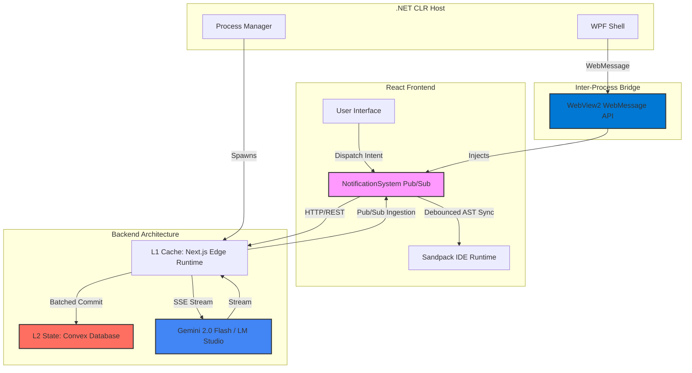

# Bolt Engine — Real-Time AI Synthesis System

**A distributed, real-time AI system that streams structured code into a live IDE with fault-tolerant connectivity and hybrid runtime execution.**

---

## Why This Project Exists

The Bolt Engine was engineered to solve several critical bottlenecks in modern generative AI interfaces:
- **High-Latency AI Streaming**: Masking the massive generation times (20–60 seconds) of large foundational models.
- **UI Rendering Bottlenecks**: Preventing React from freezing or thrashing during high-frequency token ingestion (50+ tokens/second).
- **Serverless Runtime Timeouts**: Avoiding the standard 10-15 second execution limit imposed by Vercel's proxy layer.
- **Network Fragility & Cross-Runtime Communication**: Ensuring that a local .NET Host and a React frontend can synchronize state without brittle HTTP polling or blocked ports.

---

## System Architecture

```mermaid
graph TB
    subgraph Client [React Frontend]
        UI[User Interface]
        PUB[NotificationSystem Pub/Sub]
        IDE[Sandpack IDE Runtime]
    end

    subgraph IPC [Inter-Process Bridge]
        WEB[WebView2 WebMessage API]
    end

    subgraph Host [.NET CLR Host]
        WPF[WPF Shell]
        PROC[Process Manager]
    end

    subgraph Server [Backend Architecture]
        L1[L1 Cache: Next.js Edge Runtime]
        L2[L2 State: Convex Database]
        LLM[Gemini 2.0 Flash / LM Studio]
    end

    UI -->|Dispatch Intent| PUB
    PUB -->|HTTP/REST| L1
    L1 -->|SSE Stream| LLM
    LLM -->|Stream| L1
    L1 -->|Pub/Sub Ingestion| PUB
    PUB -->|Debounced AST Sync| IDE
    L1 -->|Batched Commit| L2

    PROC -->|Spawns| L1
    WPF -->|WebMessage| WEB
    WEB -->|Injects| PUB

    style PUB fill:#f9f,stroke:#333,stroke-width:2px
    style LLM fill:#4285F4,stroke:#333,stroke-width:2px
    style L2 fill:#FF6F61,stroke:#333,stroke-width:2px
    style WEB fill:#0078D4,stroke:#333,stroke-width:2px
```

---

## Core Engineering Components

### 1. Real-Time Streaming Pipeline
The Bolt Engine abandons traditional database polling in favor of a dual-layer streaming model:
- **L1 Transient State**: Incoming tokens are aggregated directly in memory on the client side. The `NotificationSystem` broadcasts these raw chunks to listening parsers. This guarantees 60fps responsiveness.
- **L2 Persistent State**: A transactional commit is fired to the Convex backend only when the stream hits logical boundaries (e.g., an entire file is synthesized). This eliminates the connection-pool exhaustion caused by per-token database writes.

### 2. Event-Driven Pub/Sub System
React's rendering lifecycle is a massive bottleneck for high-frequency token streams. By utilizing a global `NotificationSystem`, the engine decouples the streaming data pipeline from the Virtual DOM reconciliation tree.
- Only the specific component tasked with parsing the AST (Abstract Syntax Tree) subscribes to the stream event.
- Prevents UI layout thrashing, ensuring smooth user interactions during the entire 60-second generation cycle.

### 3. Multi-Strategy Connectivity Layer
The system employs an aggressive fallback hierarchy for network traversal:
- **HTTP/REST Polling** → **Convex Direct (L2 Sync)** → **WebSocket (Real-Time)** → **Memory Cache (Offline)**
- If the WebSockets fail or the internet drops, the system seamlessly degrades to HTTP or pure offline cache buffering without failing the user.

### 4. Cross-Runtime IPC
For local deployments, the Next.js runtime is wrapped in a native `.NET WPF` application.
- Instead of HTTP polling to verify server health, the .NET process pushes `WebMessage` events directly into the WebView2 runtime.
- **Benefits**: Zero network latency, bypassing CORS, and immunity to port collision.

### 5. Edge Runtime Deployment
Vercel enforces a strict 10–15s execution timeout for standard serverless functions, which is insufficient for AI payload generation. The core synthesis route (`app/api/ai-chat/route.jsx`) is configured for the **Edge Runtime**. This ensures unbounded execution limits via `ReadableStream` connection keep-alives.

---

## Performance

- **Bundle Optimization**: By utilizing `next/dynamic` and `ssr: false`, heavy components like the Sandpack IDE are lazy-loaded. This reduces the initial JS payload by **30-40%**, resulting in a sub-second Time to Interactive (TTI).
- **Referential Equality**: Widespread implementation of `React.memo` and `useCallback` ensures deep component trees do not re-render unless explicitly invalidated by the parser.

---

## Engineering Trade-Offs

| Decision | Benefit | Trade-off |
|----------|----------|------------|
| **Pub/Sub vs React State** | Completely bypasses the Virtual DOM bottleneck, enabling 60fps streaming | Increases architectural complexity and makes state tracking harder to debug |
| **WebMessage IPC vs HTTP** | Zero-latency, CORS-free local host communication | Binds the desktop build strictly to the Chromium/WebView2 ecosystem |
| **Edge Runtime vs Serverless** | Prevents execution timeouts and proxy severing for long streams | Restricts use of standard Node.js native APIs (e.g., `fs`, `path`) |
| **L1/L2 Split vs Real-time DB** | Reduces database writes by 99%, preventing connection exhaustion | Multi-client synchronization during an active generation stream is eventually consistent |

---

## Failure Cases Solved

1. **Serverless Timeouts**:
   - *Failure*: Vercel cut off generations after 10s.
   - *Fix*: Migrated the pipeline to the Next.js Edge Runtime, keeping connections alive via native Streams.
2. **Render Thrashing**:
   - *Failure*: The entire app froze while typing out AI code strings.
   - *Fix*: Moved the token ingestion layer into a non-React Pub/Sub buffer, only syncing the final AST to the UI editor via a debounced hook.
3. **Localhost Port Collisions**:
   - *Failure*: The desktop app crashed if port 3000 was in use by another Next.js project.
   - *Fix*: The .NET host uses native `netstat` process checks and dynamic port injection, alongside WebView IPC, to guarantee environment isolation.

---

## Documentation

- [System Architecture](docs/ARCHITECTURE.md)
- [Performance Engineering](docs/PERFORMANCE.md)
- [Connectivity System](docs/CONNECTIVITY.md)
- [IPC Bridge](docs/IPC_BRIDGE.md)
- [Engineering Decisions](docs/ENGINEERING_DECISIONS.md)

---

## Live Demo

*The demo showcases the 60fps streaming pipeline and the instantaneous L1 state synchronization.*

*(Placeholder: Insert architecture/streaming demonstration GIF here)*
